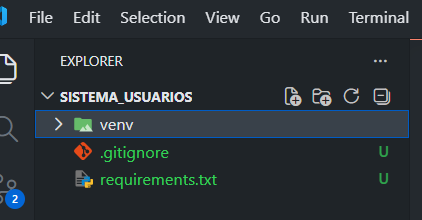
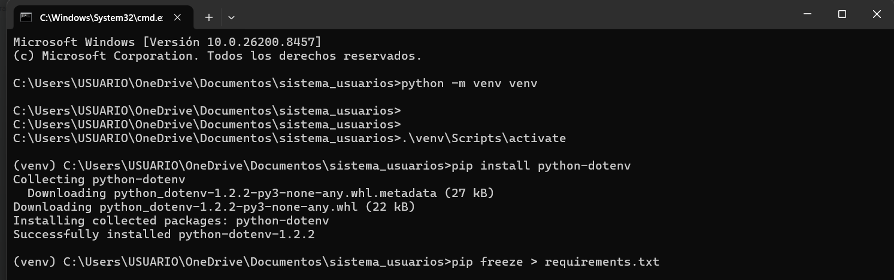
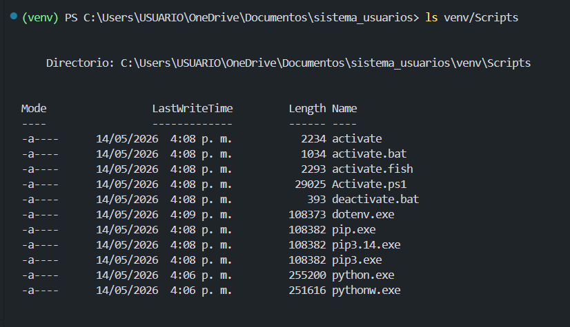
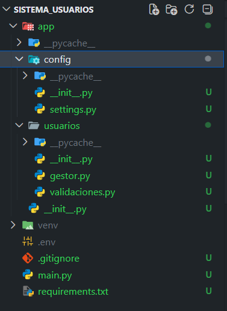
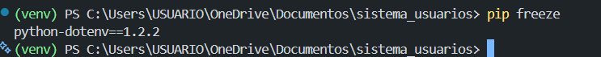
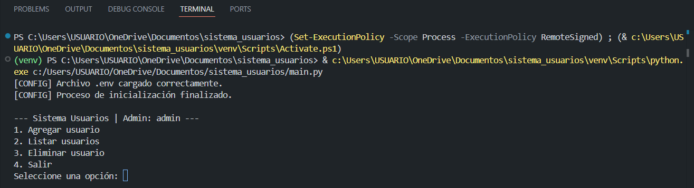
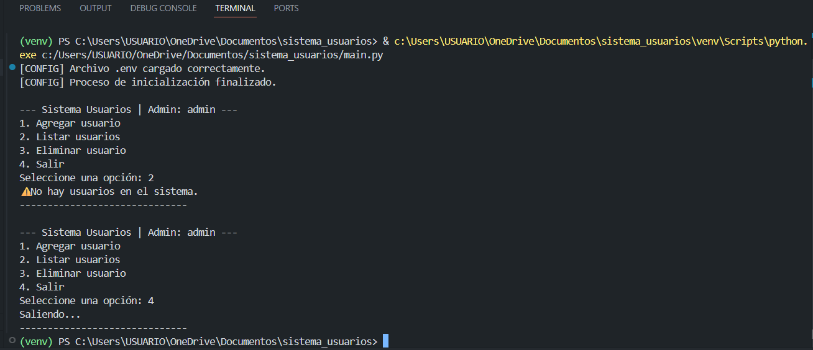
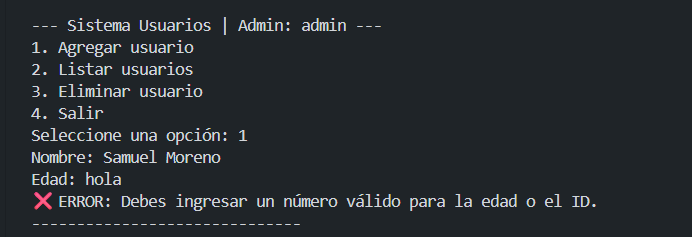
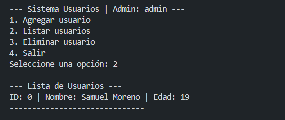
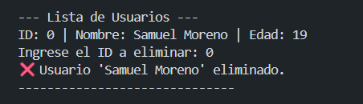

# 🧑‍💻 Sistema de Usuarios

Sistema modular en Python para gestión de usuarios por consola, con soporte de variables de entorno mediante `python-dotenv`.

---

## Estructura del Proyecto

```
sistema_usuarios/
│── app/
│   │── __init__.py
│   │── images/               # Capturas del proyecto
│   │   │── ejem1.png
│   │   │── ejem2.png
│   │   └── ... (hasta ejem10.png)
│   │── usuarios/
│   │   │── __init__.py
│   │   │── gestor.py         # CRUD de usuarios en memoria
│   │   └── validaciones.py   # Validación de nombre y edad
│   └── config/
│       │── __init__.py
│       └── settings.py       # Clase Config: carga y expone variables de entorno
│── venv/                     # Entorno virtual (NO subir al repo)
│── .env                      # Variables de entorno reales (NO subir al repo)
│── .env.example              # Plantilla de variables de entorno
│── main.py                   # Punto de entrada del programa
│── requirements.txt          # Dependencias del proyecto
└── README.md
```

---

## Crear el Entorno Virtual

Antes de instalar cualquier dependencia, crea un entorno virtual para aislar el proyecto:

```bash
# Windows
python -m venv venv

# macOS / Linux
python3 -m venv venv
```

Luego actívalo:

```bash
# Windows (CMD)
venv\Scripts\activate

# Windows (PowerShell)
venv\Scripts\Activate.ps1

# macOS / Linux
source venv/bin/activate
```

Cuando el entorno esté activo verás `(venv)` al inicio de tu terminal.

---

## Instalar Dependencias

Con el entorno virtual activo, instala las dependencias del proyecto:

```bash
pip install -r requirements.txt
```

El archivo `requirements.txt` contiene:

```
python-dotenv==1.2.2
```

---

## La Ejecucion del Proyecto

Desde la raíz del proyecto (donde está `main.py`), con el entorno virtual activo:

```bash
python main.py
```

Verás el menú principal en consola:

```
[CONFIG] Archivo .env cargado correctamente.
[CONFIG] Proceso de inicialización finalizado.

--- Mi App | Admin: root ---
1. Agregar usuario
2. Listar usuarios
3. Eliminar usuario
4. Salir
```

---

## Las variables de entorno

El proyecto usa un archivo `.env` en la raíz para configurar el sistema sin tocar el código. Copia el archivo de ejemplo y edítalo con tus datos:

```bash
cp .env.example .env
```

Contenido del `.env.example`:

```env
# Información básica del sistema
APP_NAME="Nombre de tu Aplicación"
VERSION="1.0.0"

# Credenciales y Roles
ADMIN_USER="TuUsuarioAquí"
```

| Variable     | Descripción                          | Valor por defecto  |
|-------------|--------------------------------------|--------------------|
| `APP_NAME`  | Nombre que aparece en el menú        | `Sistema Base`     |
| `VERSION`   | Versión del sistema                  | `1.0.0`            |
| `ADMIN_USER`| Usuario administrador mostrado       | `Invitado`         |

> ⚠️ El archivo `.env` está en el `.gitignore` y **no debe subirse al repositorio**.

---

## Módulos y Paquetes

### `main.py`
Punto de entrada del programa. Contiene la función `menu()` que:
- Llama a `Config.cargar_configuracion()` al arrancar.
- Presenta el menú interactivo en un bucle `while True`.
- Gestiona excepciones (`ValueError`, `IndexError`) para entradas inválidas del usuario.

---

### `app/config/settings.py` — Paquete `config`
Define la clase `Config` con atributos de clase y un método estático `cargar_configuracion()` que:
- Carga el archivo `.env` usando `load_dotenv()`.
- Asigna los valores a los atributos de clase con `os.getenv()`.
- Si no encuentra el `.env`, usa valores por defecto sin romper el programa.

```python
from app.config.settings import Config
Config.cargar_configuracion()
print(Config.APP_NAME)  # → valor del .env o "Sistema Base"
```

---

### `app/usuarios/gestor.py` — Paquete `usuarios`
Maneja el almacenamiento en memoria (`usuarios_db`) y expone tres funciones:

| Función                      | Descripción                                      |
|-----------------------------|--------------------------------------------------|
| `registrar_usuario(nombre, edad)` | Agrega un dict `{nombre, edad}` a la lista |
| `listar_usuarios()`          | Retorna todos los usuarios formateados           |
| `eliminar_usuario(indice)`   | Elimina por índice con `.pop()` (lanza `IndexError` si no existe) |

---

### `app/usuarios/validaciones.py` — Paquete `usuarios`
Funciones de validación puras, sin efectos secundarios:

| Función               | Regla                                         |
|----------------------|-----------------------------------------------|
| `validar_nombre(nombre)` | El nombre debe tener al menos 3 caracteres |
| `validar_edad(edad_str)` | La edad debe ser un entero entre 0 y 110   |

---

## La estructura Modular

El proyecto aplica una **separación de responsabilidades** clara:

```
Entrada de usuario (main.py)
        │
        ├──▶ Configuración (app/config/settings.py)
        │        └─ Lee variables de entorno con python-dotenv
        │
        └──▶ Lógica de negocio (app/usuarios/)
                 ├─ gestor.py      → operaciones CRUD
                 └─ validaciones.py → reglas de validación
```

Cada carpeta dentro de `app/` es un **paquete Python** (tiene su propio `__init__.py`). Esto permite importar los módulos de forma clara y escalable:

```python
from app.config.settings import Config
from app.usuarios import gestor
from app.usuarios.validaciones import validar_nombre, validar_edad
```

Esta arquitectura facilita agregar nuevos módulos (por ejemplo `app/reportes/` o `app/auth/`) sin tocar los existentes.

---

##  Capturas del Proyecto










